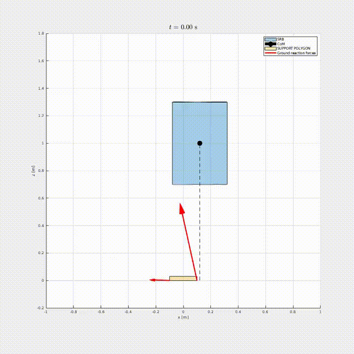

# underactuated-examples
This repo contains a collection of coding examples for the course [Underactuated Robots](http://www.diag.uniroma1.it/%7Eoriolo/ur_LL/)

## `floating-base-dynamics`

Contains two simple examples in which the floating base dynamics is computed using MATLAB Symbolic Math Toolbox.
It also shows the derivation of the Centroidal Dynamics and the CMM for a 2-link robot and the constrained reduced model for the cart-pendulum system.

### Requirements
These are Live Scripts that require MATLAB and the Symbolic Math Toolbox.

## `pybullet-pinocchio-2R`

This is a dynamic simulation of a 2R manipulator in a vertical position, it uses pybullet and its GUI for the simulation and pinocchio to compute the kinematic and dynamics quantities relevant for control.

### Requirements
It requires to install 
* pinocchio
* pybullet

which can be installed (on linux) via 
```
pip install pybullet pin
```
### Execution
The example can be executed by running (from the main repo directory):
```
python pybullet-pinocchio-2R
```

### Notes
Additional examples on the use of pinocchio can be found in the [Pinocchio documentation](https://gepettoweb.laas.fr/doc/stack-of-tasks/pinocchio/master/doxygen-html/index.html), in this repository containing material for the [Memmo Winter-school](https://github.com/nmansard/wsmemmo_pinocchio) and in the official [cheatsheet](https://github.com/stack-of-tasks/pinocchio/blob/master/doc/pinocchio_cheat_sheet.pdf).


## `multiple-shooting-SRB`
Example of multiple shooting trajectory optimization for the balancing of a planar single rigid body using contact forces.

<div align="center">
	
</div>

### Requirements

* MATLAB
* CasADi (MATLAB interface)

The CasADi directory must be placed somewhere in the MATLAB path or can be imported directly in the code. Here it is assumed that a `casadi-matlab` directory is present in the parent directory.

### Execution
Simply run the `srb_to.m` script from MATLAB.
